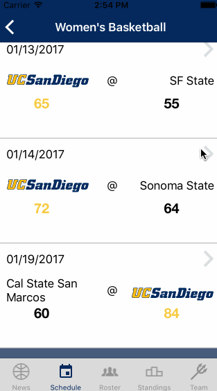
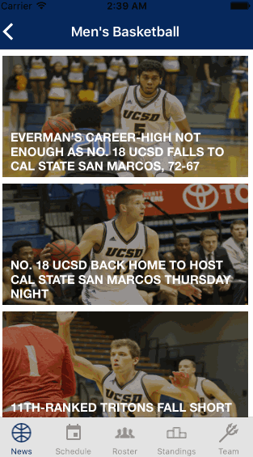
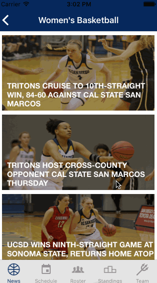
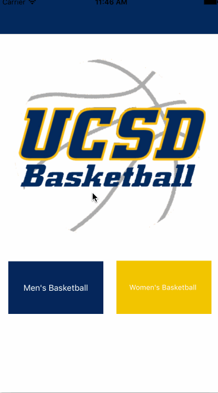

UCSD Athletics

### Front Page

Front page. Users can choose between men's or women's basketball team. 

### News and Headlines

The six most recent stories from the athletics website are shown on the news tab on the bottom left corner. Users can press on the image to go to the story. 

### Schedule

Past games of schedules are colored in white while upcoming games are colored in blue. 

### Previous Games

Users can press on past games to access the team stats. They can also access the boxscore page for more detailed stats. 

### Roster and Player Profile

When users press on a player cell, the app will show the player profile, which contains stats and vital informations.

### Standings

Standings of team in the CCAA.

### Team Stats

Overall team stats, past three games and team leaders. 

