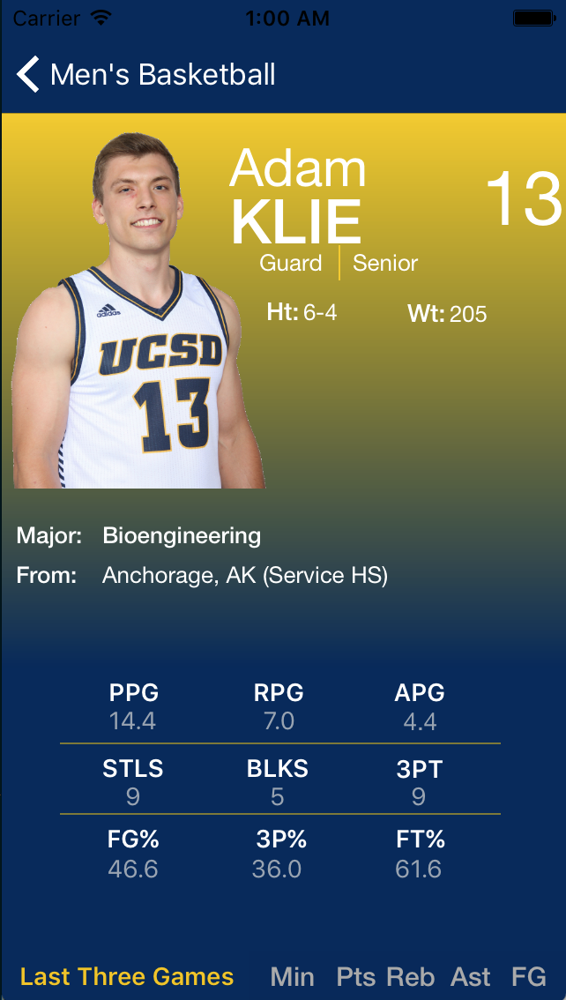

[Check it out on the App Store](https://itunes.apple.com/us/app/ucsd-basketball/id1200178740?mt=8)

## Introduction

Before creating the app, I was the Associate Sports Editor for the UCSD Guardian, an on campus student-led newspaper outlet for the UC San Diego campus. Although the UCSD Athletics site had game stats and info on the basketball team, it was difficult for writers and myself to extract both individual player/team stats and interesting numbers from the site due to its rather static interface, lack of interactive features and poor accessibility.

That's when I decided to create the app. I decided to go with an iOS app as it was a tool that I have always wanted to learn. For the data and stats themselves, I created a scraper to parse through the HTML pages containing the stats. At first, the app was intended as a stat searching app to help the writers at the UCSD Guardian improve their writing experience.

However, halfway through, I decided to broaden my audience and release the app to the general public. The basketball teams just had their best seasons of the school's history and were favorites to make it to the Final Four. However, due to our athletics program being Division II and lack of interest from our student body, the campus seemed oblivious to the growing success of the program. I wanted this app to promote more interest of the basketball teams themselves, student-athletes and to promote the sports culture of our campus. 

I ended up collaborating with Ken Grosse, Senior Associate Athletics Director of Tritons Athletics. We planned for the app to release a week before Spirit Night, the biggest game of the season. Although, the app did not receive as much downloads as I wanted, it was a great learning experience for me to start creating an app from scratch, with no knowledge on how to work in xCode/Objective - C, to working with the Apple Store team for the deployment of the app. 

## Front Page

Front page. Users can choose between men's or women's basketball team. 

***

## News and Headlines

The six most recent stories from the athletics website are shown on the news tab on the bottom left corner. Users can press on the image to go to the story. 

***

## Schedule

Past games are colored in white while upcoming games are colored in blue. 

***

## Previous Games

Users can press on past games to access the game stats. They can also access the boxscore page for more player stats and play-by-play. 

***

## Roster and Player Profile

When users press on a player cell, the app will show the player profile, which contains stats and vital informations.* 

*Background color of player profile not correctly captured by software. Following image shows what it actually looks like.

***

## Standings

Standings of teams in the CCAA from www.goccaa.org.

***

## Team Stats

Overall team stats, stats from the past three games and team leaders. 

***

## App Icon

